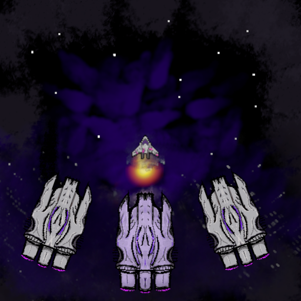
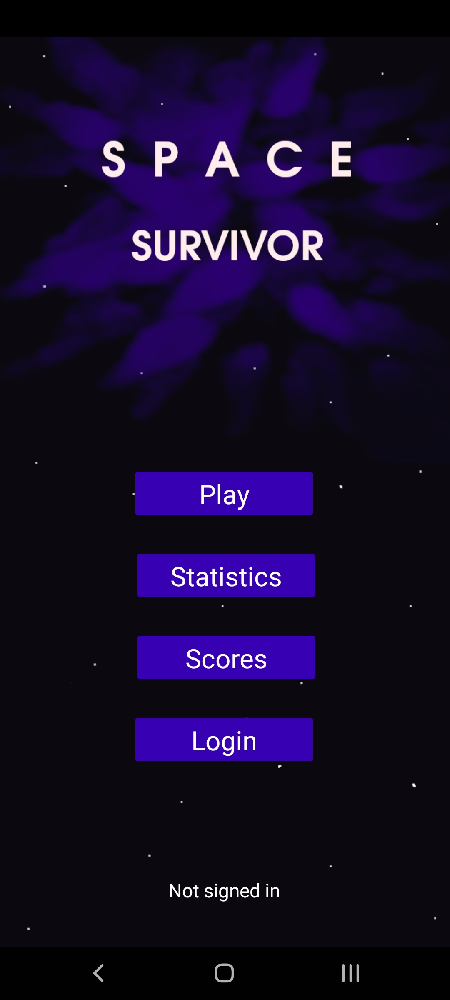
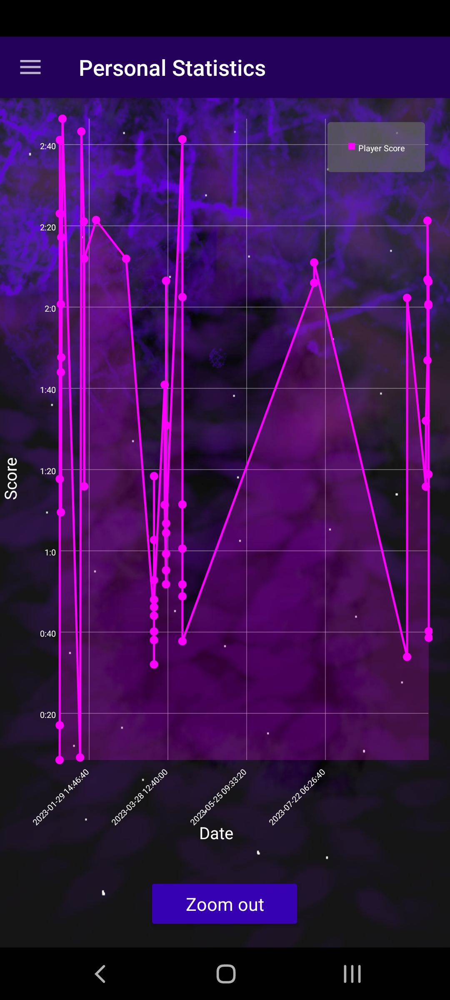
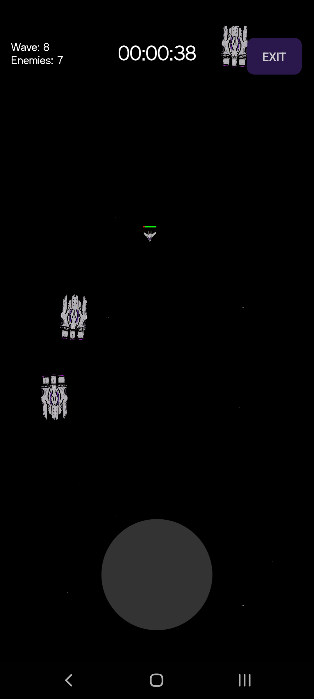
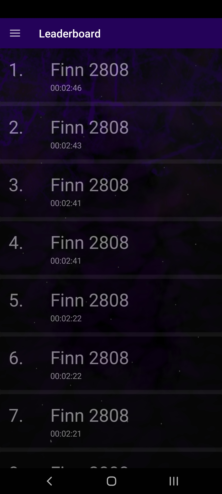

# Space Survivor

*Space Survivor* is an Android game designed for those who crave the thrill of surviving in the depths of space while evading relentless alien spaceships.

     
    
     

## Features

### User Management and Data Tracking

- **Leaderboard**: Compete with players worldwide and see if you can make it to the top 100.
- **Google Authentication**: Sign in to save your scores to a Firebase Realtime Database.
- **Statistics**: Keep track of your score history with the zoom-in and zoom-out functionality.
- **Interactive Statistics**: Click on specific data points in the statistics page to view more information.
- **User Notifications**: Receive prompts to log in when trying to access your statistics without being logged in.
- **Intuitive Navigation**: Navigate seamlessly with a dynamic NavDrawer and menu items that adapt to your current status (logged in or not).

### Custom Animations and Visuals

- **Transitions**: Enjoy smooth custom transition animations between fragments.
- **Toolbar Animation**: Experience a unique animation for revealing and hiding the toolbar.
- **Custom Backgrounds**: Immerse yourself in the game's atmosphere with specially crafted backgrounds for the main menu, statistics page, and leaderboard.

### Game-specific Features

- **Dynamic Environment**: Experience an infinitely repeating background that adds depth to the gameplay.
- **Healthbar**: Keep an eye on your health as it dynamically follows your character and displays your current status.
- **Collision Effects**: Engage in intense gameplay as collisions with enemies cause your character to slow down and play a damage sound.
- **Timer**: Race against the clock with a timer displaying your game time.
- **Wave Updates**: Stay informed about the current wave and the number of enemies in each wave.
- **Damage Effects**: Witness your spaceship becoming increasingly damaged as your health depletes.
- **Responsive Design**: Play comfortably in both portrait and landscape modes.
- **Enemy Variety**: Encounter different enemy types, including standard (moves straight to its goal) and hunters (pursue and attempt to catch the player).
- **Progressive Stages**:
    1. **First Stage**: Face standard enemies.
    2. **Second Stage**:
        - Encounter a mix of standard and hunter enemies.
        - Experience a musical cue to signal the start of the next stage.
    3. **Third Stage**:
        - Challenge yourself with standard and hunter enemies.
        - Hear a distinct musical cue as you enter the third stage.
        - Battle enemies with increased speed.
      
# Impressions
Here are some screenshots from the game:

    
    
    
    

# License

This project is licensed under the GNU General Public License v3.0 - see the [LICENCE](LICENCE.md) file for details.

# Further References

For implementing Google Login/Logout with Firebase, follow this [comprehensive guide](https://medium.com/swlh/google-login-and-logout-in-android-with-firebase-kotlin-implementation-73cf6a5a989e).

For game-specific implementations, refer to the [KorGE documentation](https://docs.korge.org/korge/). Note that this project uses KorGE 2.7.0 due to regressions in newer versions (source: contact with the author on the official Discord channel).

Explore useful examples for using KorGE in the [KorGE Samples repository](https://github.com/korlibs/korge-samples).
